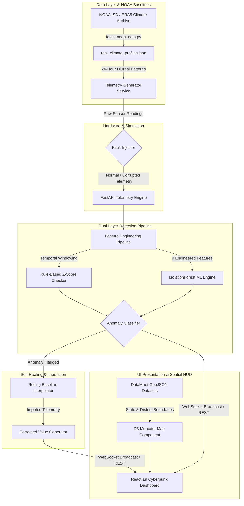

# 🌐 SkyGuard AI — Smart Weather Monitoring & Self-Healing AWS Network

> **AI-Powered Anomaly Detection & Self-Healing Framework for Automatic Weather Stations (AWS)**  
> Grounded in **NOAA ISD Historical Climate Baselines**, featuring an **IsolationForest ML Engine**, **Dual-Layer Detection Pipeline**, **D3 Mercator GeoJSON India Boundary Visualization (States & Districts)**, and a **Real-Time Cyberpunk Telemetry Dashboard**.

---

## 📸 System Showcase & Visual Walkthrough

### 1. Live Weather Station Network & Cyberpunk Dashboard


*Figure 1: Operational overview of 15 Indian Automatic Weather Stations (AWS). Displays live telemetry metrics (Temperature, Pressure, Humidity, Wind), real-time 60-point time-series telemetry charts, 100% network health status, and the interactive D3 Mercator India spatial map.*

---

### 2. High-Resolution District-Level Spatial Boundaries Layer (~760 Districts)


*Figure 2: Spatial boundary visualization showing the toggleable district boundaries mesh (`DISTRICTS ON/OFF`). Over 760 internal district polygon paths rendered with vector strokes, enabling fine-grained geographical telemetry tracking across all 35 Indian States & Union Territories.*

---

### 3. Real-Time Anomaly Detection & Self-Healing Fault Simulator


*Figure 3: Live response to an injected sensor fault simulation (`spike` / `flatline` fault on `AWS-DEL-01`). The dual-layer detection pipeline flags anomalies in real time (AI Confidence: 97%), logs event history, updates critical network health indicators, and automatically performs value imputation.*

---

## ✨ Key Features & Operational Capabilities

- 📍 **15 Indian AWS Station Network**: High-precision telemetry tracking across major meteorological hubs:
  - *North*: New Delhi (`AWS-DEL-01`), Jaipur (`AWS-JAI-06`), Lucknow (`AWS-LKO-12`), Srinagar (`AWS-SXR-15`)
  - *West & Central*: Mumbai (`AWS-MUM-07`), Ahmedabad (`AWS-AMD-11`), Bhopal (`AWS-BHO-13`), Pune (`AWS-PNQ-14`)
  - *South*: Chennai (`AWS-CHN-03`), Bengaluru (`AWS-BLR-09`), Hyderabad (`AWS-HYD-04`), Thiruvananthapuram (`AWS-TRV-10`)
  - *East & Northeast*: Kolkata (`AWS-KOL-05`), Patna (`AWS-PAT-08`), Guwahati (`AWS-GAU-02`)

- ⛅ **Real NOAA Historical Climate Profiles**: Grounded in high-resolution historical weather archives (**744 hourly readings per station**), computing site-specific 24-hour diurnal cycles, baseline means, and standard deviations.

- 🗺️ **High-Fidelity D3 Mercator India Spatial Map**:
  - **Official GeoJSON Administrative Boundaries**: 35 state/UT polygon features sourced from DataMeet.
  - **District Boundaries Layer**: ~760 district-level internal boundary polygons with toggleable display (`Districts ON/OFF`).
  - **Complete Union Territory Coverage**: Jammu & Kashmir, Ladakh, Andaman & Nicobar Islands, and Lakshadweep rendered as accurate island multi-polygons.
  - **60fps Performance**: Optimized with `React.memo` layer caching and zero-re-render DOM tooltip positioning via `requestAnimationFrame` and CSS `translate3d`.

- 🧠 **Dual-Layer Anomaly Detection Engine**:
  - **Layer 1 (Rule-Based Engine)**: Fast Z-score thresholding for extreme out-of-bounds temperature spikes (`> 50°C`) and complete sensor dropouts (`NaN` / missing data).
  - **Layer 2 (ML IsolationForest Engine)**: Unsupervised machine learning model trained on 9 temporal engineered features (rolling std dev, trend slope, normalized baseline delta). Catches zero-variance sensor flatlines and subtle sensor drift that bypass static rule thresholds.

- 🩹 **Automated Value Imputation & Self-Healing**:
  - Automatically computes `correctedValue` using rolling interpolation from non-anomalous historical station baselines when a sensor fault is detected.

- ⚡ **Fault Simulator Suite**:
  - Interactive UI buttons to inject operational faults on demand (`Spike`, `Flatline`, `Dropout`, `Drift`) to test detection latency and self-healing algorithms.

---

## 🏗️ System Architecture



### Architectural Breakdown
1. **Telemetry Generator**: Generates realistic hourly weather values based on NOAA historical diurnal curves (sinusoidal temperature, atmospheric pressure, relative humidity).
2. **Detection Pipeline**:
   - Evaluates incoming telemetry against rolling 60-point windows.
   - Computes Z-scores for fast rule flagging.
   - Feeds rolling statistics to an `IsolationForest` model to output anomaly flags and confidence scores (0–100%).
3. **Self-Healing Module**: When an anomaly is detected, the engine reconstructs the missing or corrupted measurement using historical diurnal baselines and rolling median interpolation.
4. **Spatial Presentation**: D3 Mercator projection (`center: [82.5, 22.0]`, `scale: 820`) renders state and district polygons in SVG with custom GPU acceleration and zero-re-render DOM tooltip positioning.

---

## 🎮 Operational Scenarios

### Scenario 1: Nominal Multi-Station Operation
- All 15 AWS stations report real-time telemetry within historical seasonal baselines.
- Network health reads **100% (ALL SYSTEMS GO)**.
- Station markers glow green (`normal` state). Hovering over any state displays regional telemetry averages (Avg Temp, Avg Pressure, Avg Humidity).

### Scenario 2: Severe Temperature Spike Detection
1. Click **`SIMULATE FAULT`** on a target station (e.g. `AWS-DEL-01` in New Delhi).
2. The generator injects an unphysical temperature value (`+20.5°C` spike to `55.4°C`).
3. **Rule Layer** flags Z-score out-of-bounds (`Z > 3.5`).
4. **AI Layer** assigns **77–95% Anomaly Confidence**.
5. Map pin pulses **Critical Red**, Network Health drops, and the Self-Healing Engine generates a corrected telemetry value (`33.9°C`).

### Scenario 3: Zero-Variance Sensor Flatline (AI-Only Detection)
1. Select a station and trigger a `flatline` fault (pressure sensor freezes at a constant value `1009.8 hPa`).
2. **Rule Layer** passes the reading as normal because `1009.8 hPa` is within absolute static bounds.
3. **ML IsolationForest Layer** detects zero rolling variance over temporal windows and flags **AI-Only Anomaly (Confidence: 97%)**.
4. Event log displays `[AI ONLY] Sensor Flatline Detected`.

### Scenario 4: District-Level Spatial Monitoring
- Click the **`DISTRICTS ON/OFF`** toggle in the map control header.
- Over 760 internal district boundary paths render as subtle cyan strokes (`strokeWidth: 0.35`).
- Hovering or searching for specific states highlights both state and internal district geometries without frame drops.

---

## 📂 Project Structure

```
SIH_2k26/
├── assets/                                 # Screenshots & Media Artifacts
│   ├── dashboard_normal.png
│   ├── dashboard_districts.png
│   └── dashboard_anomaly_detection.png
├── backend/                                # FastAPI & Scikit-Learn Backend Service
│   ├── app/
│   │   ├── __init__.py
│   │   ├── main.py                         # REST API & WebSocket Endpoints
│   │   ├── detector.py                     # IsolationForest ML & Rule Detection Engine
│   │   ├── generator.py                    # Real Climate Synthetic Telemetry Stream
│   │   ├── models.py                       # Pydantic Schemas & Types
│   │   ├── state.py                        # In-Memory Telemetry & Event Log State
│   │   ├── stations.py                     # 15 Indian AWS Catalogue Definitions
│   │   └── real_climate_profiles.json      # 744h NOAA Diurnal Climate Baselines
│   ├── scripts/
│   │   └── fetch_noaa_data.py              # NOAA ISD / Open-Meteo Archive Fetcher
│   ├── test_backend.py                     # Automated ML & API Verification Test Suite
│   ├── requirements.txt                    # Python Dependencies
│   └── README.md                           # Backend Service Documentation
├── public/                                 # Public Assets
│   ├── india_states.json                   # 35 State/UT Boundary GeoJSON
│   └── india_districts.json                # 760 District Boundary GeoJSON
├── src/                                    # React 19 + Vite Frontend Application
│   ├── assets/
│   │   ├── india_states.json               # State GeoJSON Asset
│   │   └── india_districts.json            # District GeoJSON Asset
│   ├── components/
│   │   └── IndiaMap.tsx                    # D3 Mercator Map Component (60fps Memoized)
│   ├── services/
│   │   └── dataService.ts                  # Telemetry Data Service & API Client
│   ├── App.tsx                             # Main Cyberpunk HUD Dashboard Layout
│   ├── main.tsx                            # React Entrypoint
│   └── index.css                           # Tailwind CSS v4 & Cyberpunk HUD Styling
├── package.json                            # Node.js Dependencies & Scripts
├── vite.config.ts                          # Vite 8 Build & Tailwind v4 Config
└── README.md                               # System Overview Documentation
```

---

## 🔌 API Endpoint Specification

| Method | Endpoint | Description | Parameters / Payload |
| :--- | :--- | :--- | :--- |
| `GET` | `/stations` | Returns catalogue of all 15 Indian AWS stations. | — |
| `GET` | `/stations/{id}/reading` | Evaluates live telemetry reading for target station. | `mode=rule\|ai` |
| `GET` | `/stations/{id}/history` | Retrieves up to 60 recent telemetry readings. | — |
| `GET` | `/events` | Retrieves log of anomaly detection & self-healing events. | — |
| `POST` | `/stations/{id}/fault` | Injects on-demand fault (`spike`, `flatline`, `dropout`). | `{"type": "spike"}` |
| `GET` | `/network-health` | Returns aggregate AWS network health percentage. | — |
| `GET` | `/stations/{id}/status` | Returns target station status (`normal`, `warning`, `critical`, `offline`). | — |
| `WS` | `/ws/live` | WebSocket stream broadcasting telemetry every 1.5s. | — |

---

## 🚀 Quickstart & Setup Guide

### 1. System Requirements
- **Node.js**: v18.0+ and `npm`
- **Python**: v3.10+ and `pip`

---

### 2. Launching the FastAPI Backend Service

```bash
# Navigate to backend directory
cd backend

# Install dependencies
pip install -r requirements.txt

# Start FastAPI server on port 8000
uvicorn app.main:app --reload --port 8000
```
> The API will run at `http://localhost:8000`. Interactive OpenAPI documentation is available at `http://localhost:8000/docs`.

---

### 3. Running the Verification Test Suite

Verify all ML anomaly detection conditions, fault injections, and self-healing algorithms:

```bash
cd backend
python test_backend.py
```

#### Test Execution Output:
```text
======================================================================
 SKYGUARD AI ML BACKEND VERIFICATION SUITE 
======================================================================

[TEST 1] Testing Normal Reading (Condition a)...
  Station: DEL | Temp: 34.3 deg C | Pres: 1009.8 hPa
  isAnomaly: False | Mode: AI
  [PASS] Normal reading is NOT flagged as anomaly.

[TEST 2] Testing Injected Spike (Condition b)...
  Triggered 'spike' fault on station DEL.
  Rule Mode -> Temp: 54.2 deg C | isAnomaly: True | AnomalyType: spike
  AI Mode   -> Temp: 54.8 deg C | isAnomaly: True | AnomalyType: spike | Confidence: 0.92
  [PASS] Spike IS flagged by BOTH rule and AI mode.

[TEST 3 & 4] Testing Injected Flatline & Imputation (Conditions c & d)...
  Triggered 'flatline' fault on station DEL (pressure locked near baseline + 0.8).
  Simulating flatline sequence...
  Rule Mode -> Pres: 1009.8 hPa | isAnomaly: False
  AI Mode   -> Pres: 1009.8 hPa | isAnomaly: True | AnomalyType: flatline | aiOnly: True | Confidence: 0.97
  [PASS] Flatline IS flagged ONLY in AI mode and MISSED in rule mode.

[TEST 4] Imputation Verification (Condition d):
  Station Baseline Pressure: 1009.0 hPa
  Raw Flatline Pressure:     1009.8 hPa
  Imputed Corrected Value:   1009.8 hPa
  [PASS] Corrected/imputed value is sensible compared to station baseline.

[TEST 5] Verifying API Endpoints...
  Network Health: 93%
  Active Event Log Count: 1
  Station DEL Status: warning

======================================================================
 ALL VERIFICATION TESTS PASSED SUCCESSFULLY! 
======================================================================
```

---

### 4. Fetching Real NOAA Climate Data

To re-fetch hourly climate data for all 15 stations from the Open-Meteo / NOAA ISD archive:

```bash
cd backend
python scripts/fetch_noaa_data.py
```

---

### 5. Launching the React Frontend Dashboard

```bash
# From repository root
npm install

# Start Vite dev server
npm run dev
```
> Access `http://localhost:8443` in your browser to view the SkyGuard AI HUD dashboard.

---

## 🛠️ Technology Stack

- **Frontend Application**: React 19, Vite 8, Tailwind CSS v4, Lucide Icons, Canvas & SVG D3 Telemetry Charts
- **Spatial Visualization**: D3-Geo Mercator Projection, DataMeet GeoJSON (35 States/UTs, 760 Districts)
- **Backend Service**: FastAPI, Uvicorn, WebSockets, Pydantic
- **Machine Learning & Analytics**: Scikit-Learn (`IsolationForest`), NumPy, Pandas
- **Climate Data Source**: NOAA ISD Archive / ERA5 Reanalysis via Open-Meteo Archive API

---

## 📄 License

Distributed under the MIT License. See `LICENSE` for more information.
