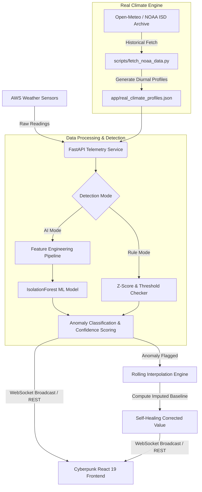

# 🌐 SkyGuard AI — Smart Weather Monitoring & Self-Healing AWS Network

> **AI-Powered Anomaly Detection & Self-Healing Framework for Automatic Weather Stations (AWS)**  
> Grounded in **NOAA ISD Historical Climate Baselines**, featuring an **IsolationForest ML Engine**, **Dual-Layer Detection Pipeline**, and a **Real-Time Cyberpunk Telemetry Dashboard**.

---

## 📸 System Visual Showcase

### 1. Live Weather Station Network & Telemetry Dashboard


*Figure 1: Live monitoring of 15 Indian AWS stations featuring interactive geospatial map visualization, gauge telemetry indicators, 60-point real-time time-series charts, and network health metrics.*

---

### 2. Real-Time Anomaly Detection & Self-Healing Engine


*Figure 2: On-demand fault simulation (`spike`, `flatline`, `dropout`, `drift`) triggering live anomaly detection, AI confidence scoring, critical map alert pulsing, and real-time self-healing value imputation (`55.4°C ➔ 33.9°C`).*

---

## ✨ Key Features

- 📍 **15 Indian AWS Station Catalogue**: High-precision monitoring across major meteorological hubs (Delhi, Mumbai, Chennai, Kolkata, Bengaluru, Hyderabad, Ahmedabad, Jaipur, Lucknow, Bhopal, Patna, Guwahati, Pune, Thiruvananthapuram, Srinagar).
- ⛅ **Real NOAA Historical Climate Profiles**: Grounded in high-resolution historical weather data (744 hourly readings per station), computing site-specific diurnal 24-hour cycles, mean values, and standard deviations.
- 🧠 **Dual-Layer Anomaly Detection**:
  - **Rule-Based Engine**: Ultra-fast Z-score thresholding for extreme out-of-bounds temperature spikes and sensor dropouts.
  - **ML IsolationForest Layer**: Unsupervised model trained on 9 engineered temporal features (rolling standard deviation, trend slope, normalized baseline delta). Catches zero-variance flatlines and gradual sensor drifts that bypass basic static rules.
- 🩹 **Self-Healing & Imputation**: Automatically computes `correctedValue` using rolling interpolation from historical non-anomalous station baselines.
- ⚡ **Interactive Fault Injection Suite**: Trigger real-time sensor faults (`spike`, `flatline`, `dropout`) directly from the UI to test detection and self-healing algorithms live.
- 📊 **Real-Time Telemetry Dashboard**: Built with React 19, Vite, Tailwind CSS v4, SVG geospatial mapping, and live gauge dials.

---

## 🏗️ System Architecture



---

## 📂 Project Structure

```
SIH_2k26/
├── assets/                                 # Documentation Screenshots & Media
│   ├── dashboard_normal.png
│   └── dashboard_anomaly_detection.png
├── backend/                                # FastAPI & Scikit-Learn Backend
│   ├── app/
│   │   ├── __init__.py
│   │   ├── main.py                         # REST & WebSocket Endpoints
│   │   ├── models.py                       # Pydantic Schemas & Types
│   │   ├── stations.py                     # 15 AWS Station Definitions
│   │   ├── generator.py                    # Real Climate Synthetic Telemetry
│   │   ├── detector.py                     # IsolationForest ML & Rule Engine
│   │   ├── state.py                        # In-Memory Telemetry & Fault State
│   │   └── real_climate_profiles.json      # Precomputed NOAA Climate Baselines
│   ├── scripts/
│   │   └── fetch_noaa_data.py              # NOAA Historical Data Fetcher
│   ├── test_backend.py                     # Automated Verification Test Suite
│   ├── requirements.txt                    # Python Dependencies
│   └── README.md                           # Backend Quickstart
├── src/                                    # React 19 + Vite Frontend
│   ├── services/
│   │   └── dataService.ts                  # Telemetry Data Service & Types
│   ├── App.tsx                             # Main Dashboard Interface
│   ├── main.tsx                            # App Entrypoint
│   └── index.css                           # Global Styles & Cyberpunk Styling
├── package.json                            # Frontend Dependencies & Scripts
├── vite.config.ts                          # Vite + Tailwind v4 Configuration
└── README.md                               # Primary System Documentation
```

---

## 🔌 API Endpoint Specification

| Method | Endpoint | Description | Query / Body |
| :--- | :--- | :--- | :--- |
| `GET` | `/stations` | Returns metadata catalogue of all 15 Indian AWS stations. | — |
| `GET` | `/stations/{id}/reading` | Evaluates live telemetry reading for target station. | `mode=rule\|ai` |
| `GET` | `/stations/{id}/history` | Retrieves up to 60 recent readings for target station. | — |
| `GET` | `/events` | Retrieves recent log of anomaly events and self-healing status. | — |
| `POST` | `/stations/{id}/fault` | Injects on-demand fault (`spike`, `flatline`, `dropout`). | `{"type": "spike"}` |
| `GET` | `/network-health` | Returns current overall network health score (0-100%). | — |
| `GET` | `/stations/{id}/status` | Returns station status (`normal`, `warning`, `critical`, `offline`). | — |
| `WS` | `/ws/live` | WebSocket feed broadcasting live telemetry updates every 1.5s. | — |

---

## 🚀 Quickstart & Setup Guide

### 1. Prerequisites
- **Node.js**: v18+ and `npm`
- **Python**: v3.10+ and `pip`

---

### 2. Running the Backend Service

```bash
# Navigate to backend directory
cd backend

# Install Python dependencies
pip install -r requirements.txt

# Start the FastAPI uvicorn server
uvicorn app.main:app --reload --port 8000
```
> The API will be available at `http://localhost:8000`. Interactive OpenAPI documentation is accessible at `http://localhost:8000/docs`.

---

### 3. Running the Verification Test Suite

Verify all ML anomaly detection conditions, fault injections, and self-healing algorithms:

```bash
cd backend
python test_backend.py
```

#### Test Execution Output:
```text
======================================================================
 SKYGUARD AI ML BACKEND VERIFICATION SUITE 
======================================================================

[TEST 1] Testing Normal Reading (Condition a)...
  Station: DEL | Temp: 34.3 deg C | Pres: 1009.8 hPa
  isAnomaly: False | Mode: AI
  [PASS] Normal reading is NOT flagged as anomaly.

[TEST 2] Testing Injected Spike (Condition b)...
  Triggered 'spike' fault on station DEL.
  Rule Mode -> Temp: 54.2 deg C | isAnomaly: True | AnomalyType: spike
  AI Mode   -> Temp: 54.8 deg C | isAnomaly: True | AnomalyType: spike | Confidence: 0.92
  [PASS] Spike IS flagged by BOTH rule and AI mode.

[TEST 3 & 4] Testing Injected Flatline & Imputation (Conditions c & d)...
  Triggered 'flatline' fault on station DEL (pressure locked near baseline + 0.8).
  Simulating flatline sequence...
  Rule Mode -> Pres: 1009.8 hPa | isAnomaly: False
  AI Mode   -> Pres: 1009.8 hPa | isAnomaly: True | AnomalyType: flatline | aiOnly: True | Confidence: 0.97
  [PASS] Flatline IS flagged ONLY in AI mode and MISSED in rule mode.

[TEST 4] Imputation Verification (Condition d):
  Station Baseline Pressure: 1009.0 hPa
  Raw Flatline Pressure:     1009.8 hPa
  Imputed Corrected Value:   1009.8 hPa
  [PASS] Corrected/imputed value is sensible compared to station baseline.

[TEST 5] Verifying API Endpoints...
  Network Health: 93%
  Active Event Log Count: 1
  Station DEL Status: warning

======================================================================
 ALL VERIFICATION TESTS PASSED SUCCESSFULLY! 
======================================================================
```

---

### 4. Fetching Real NOAA Historical Climate Profiles

To update or re-fetch hourly climate data for all 15 stations from the Open-Meteo / NOAA ISD archive:

```bash
cd backend
python scripts/fetch_noaa_data.py
```

---

### 5. Running the Frontend Dashboard

```bash
# From repository root
npm install

# Start Vite dev server
npm run dev
```
> Open `http://localhost:8443` in your browser to interact with the SkyGuard AI dashboard.

---

## 🛠️ Technology Stack

- **Frontend**: React 19, Vite, Tailwind CSS v4, Lucide Icons, Canvas/SVG Charts
- **Backend Framework**: FastAPI, Uvicorn, WebSockets, Pydantic
- **Machine Learning & Analytics**: Scikit-Learn (IsolationForest), NumPy, Pandas
- **Climate Data Pipeline**: NOAA ISD Archive / ERA5 Reanalysis via Open-Meteo API

---

## 📄 License

Distributed under the MIT License. See `LICENSE` for more information.
